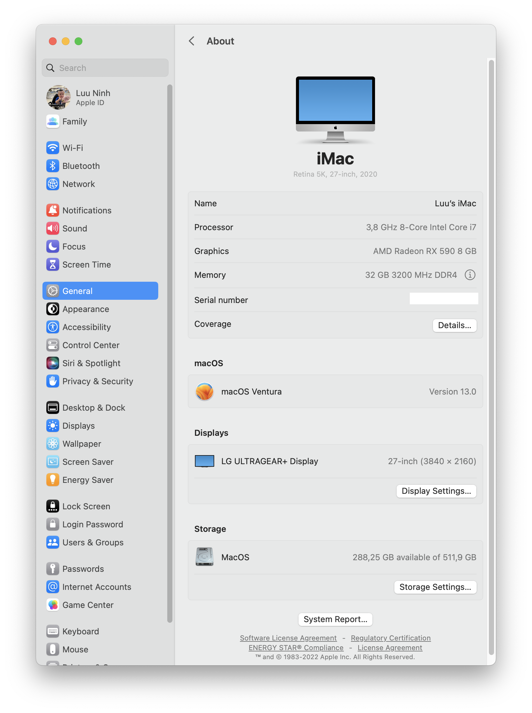

# z490i-phantom-gaming-itx-tb3-opencore

## Hardware

* Motherboard: Asrock Z490 Phantom Gaming-ITX/TB3
* CPU: Intel® Core™ i7-10700K
* GPU: NITRO + RX 590 8GB AMD 50 Gold Edition Graphics
* RAM: Corsair DOMINATOR® PLATINUM RGB 32GB (2 x 16GB) DDR4 DRAM 3200MHz C16 CMT32GX4M2C3200C16
* SSD: Samsung 970 EVO Plus PCIe NVMe V-NAND M.2 2280 500GB
* Wifi: Broadcom BCM94360NG

## Software

* OS: macOS Ventura 13.0
* Bootloader: OpenCore 0.8.5
* AppleALC 1.7.5
* Lilu 1.6.2
* VirtualSMC 1.3.0
* WhateverGreen 1.6.1